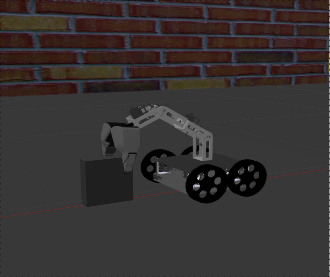

# Mobile-Manipulator-Robot-modeling-and-simulation-using-Gazebo-ROS-Noetic-
Performed Pick and place operation using a differential drive Mobile Robot with a mounted robotic arm in Gazebo. Application - cleaning in compact and cluttered environments



Authors: Rishikesh Jadhav(UID:119256534) and Nishant Awdeshkumar Pandey(UID:119247556).

## Table of Contents
1. [Introduction](#1-introduction)
2. [Process](#2-process)
3. [Robot Description](#3-robot-description)
4. [Forward Kinematics Validation](#4-forward-kinematics-validation)
5. [Inverse Kinematics Validation](#5-inverse-kinematics-validation)
6. [Workspace Study](#6-workspace-study)
7. [Assumptions](#7-assumptions)
8. [Control Method](#8-control-method)
9. [Gazebo and RViz Visualization](#9-gazebo-and-rviz-visualization)
10. [Problems Faced](#10-problems-faced)
11. [Conclusion](#11-conclusion)
12. [Steps to Run the Package](#12-steps-to-run-the-package)
13. [References](#13-references)

## 1. Introduction
Modeling a mobile robot (differential drive) with a robotic arm named CR-7. The goal is to create a versatile robot capable of cleaning spaces efficiently.

## 2. Process
The project involved a series of analyses and processes, including the study of robot kinematics (inverse and forward), validation, and simulation in Gazebo and RViz. The derived equations were intended for practical applications such as goal navigation, object manipulation, and space cleaning.

### Project Pipeline


## 3. Robot Description

Robot Type: MOBILE MANIPULATOR
Total DOF (9) = Robotic arm DoF (6) + Mobile robot DoF (3)


#### DIMENSIONS:
- Chassis property(units): Length: 0.19, Width: 0.19, Height: 0.070
- Wheel property: Radius(units):0.055, width: 0.022, Mass=0.2
- Shoulder roll link(units): Length: 0.09, Width: 0.047, Height: 0.035
- Shoulder pan link(units): Length: 0.09, Width: 0.047, Height: 0.035
- Elbow pan Link(units): Length: 0.09, Width: 0.047, Height: 0.035
- Elbow pitch Link(units): Length: 0.09, Width: 0.047, Height: 0.035
- Gripper(units): Length: 0.05, Width: 0.010
- Gripper type: 2 Finger gripper


## 4. Forward Kinematics Validation
To validate forward kinematics, a video of the robot's movement in Gazebo and RViz is available Below

[](https://www.youtube.com/watch?v=eiZ5ZfvUhY8)

## 5. Inverse Kinematics Validation
To validate inverse kinematics, a video of the robot's movement in Gazebo and RViz is available below 

[](https://www.youtube.com/watch?v=jIF_iJx5u1k)


## 6. Workspace Study


Maximum workspace of the arm is as follows:
The above figure is obtained by selecting the angle limits as follows:
- Theta 1= 0:2*pi
- Theta 2= -pi/2:pi/2
- Theta 3=0:pi/2
- Theta 4= -pi/2:pi/2


## 7. Assumptions
- All the joints and objects are considered to be rigid.
- The friction and other external disturbances are not taken into
account.
- Robot self-collision is considered along with the external
obstacles and is taken into account for this scope of the project.
- The path of the arm or the robot is just one solution among all
the other solutions it can have, this may or may not be the
optimal solution.

## 8. Control Method
The differential drive mobile robot operates through a closed-loop mechanism, as outlined below:

1. **Predefined Goal:** The robot's destination is specified in the code.

2. **Fixed Starting Position:** The initial position of the robot is predetermined.

3. **Control Inputs:** Wheel control inputs are provided, and the robot's current status is monitored using the Gazebo odometer.

4. **Distance Calculation:** The current distance to the goal is computed, and control adjustments are made based on linear and angular velocity.

5. **Precise Stopping:** The robot halts 0.25 units before reaching the target location for efficient pick-up.

6. **Return Capability:** The robot can also autonomously return to its original or home position.


## 9. Gazebo and RViz Visualization

For robot movement validation, the following videos are available:

### 
- Teleop: [](https://www.youtube.com/watch?v=-0-Fz-cJO3w)
- Arm Control: [](https://www.youtube.com/watch?v=-7zCioQ0734)
- Closed Loop Control: [](https://www.youtube.com/watch?v=JkP_jU8V_Yg)
- RQT Steering: [](https://www.youtube.com/watch?v=2xNp4E0TiQg)

#### Pick and Place operation
[](https://www.youtube.com/watch?v=nk7jHL4xtvg)


## 10. Problems Faced
Robot Spawning Issues: The robot was spawning with dislocated parts, leading to incorrect simulations. Debugging and adjusting the URDF file resolved this issue.

DH Parameter Determination: Finding the Denavit-Hartenberg (DH) parameters for the robot was a task that required precision. As the robot used in our project is not universal, identifying the correct parameters was crucial for accurate kinematic analysis.

Simulation Realism: Achieving a realistic simulation proved challenging, especially in terms of adding sensors. Due to constraints, we used a Gazebo odometer instead of sensors for the closed-loop controller.


## 11. Conclusion
In conclusion, the project successfully modeled a cleaning robot, CR-7, integrating a differential drive mobile robot with a robotic arm. The robot's URDF file was accurately spawned in Gazebo and RViz, and kinematic analyses were performed for both forward and inverse kinematics.

The implementation of control methods, such as closed-loop control for the differential drive, showcased the robot's ability to navigate and stop accurately. Despite the challenges faced, the project achieved its objectives and laid the foundation for future advancements.


## 12. Steps to Run the Package

The package includes the following folders:

1. **CAD files:** Contains part files (.sldprt), assembly files (.sldasm) of the robot model.

2. **Package:** Contains another folder named "robot" that can be copied into catkin_ws/src.

   The "robot" folder contains subfolders:

   - **config:** .yaml files for controllers.
   
   - **launch:** .launch files to spawn the bot in Gazebo and RViz.
   
   - **meshes:** .dae files for various parts of the bot.
   
   - **scripts:** .py files for moving the bot (publisher, subscriber nodes).
   
   - **urdf:** .xacro file of the bot.
   
   - **worlds:** .world file where the bot is spawned in Gazebo.

   Various scripts include:

   1. **teleop.py:** Controls the bot's movement using teleop.
   
   2. **fk_validation.py:** Validates forward kinematics.
   
   3. **ik_val.py:** Validates inverse kinematics.
   
   4. **diff_control.py:** Controls the differential drive, stopping just before the goal using a closed-loop controller.
   
   5. **go_home.py:** Returns the bot to the home position (origin) after pick and place operation.
   
   6. **grasp.py:** Grasps an object using the gripper.
   
   7. **arm_control.py:** Moves the arm above the box and opens the gripper. (Note: The size of the object and friction between the gripper and the object are not right; pick and place operation was done manually in the video. Please use that as a reference for grading).
   
   8. **End_eff_trajectory.py:** Obtains the graph of the end effector trajectory for inverse kinematics validation.

To spawn the bot in Gazebo and RViz in the designed world, use the following command (with rqt_steering) after navigating to the launch folder in the terminal:

```bash
roslaunch 04-diff_drive_robot_arm.launch
```

To spawn the bot in RViz with a slider to control the various joints of the robot, use the following command after navigating to the launch folder in the terminal:

```bash
roslaunch view_demo.launch
```

To run these codes, open the scripts folder in the terminal and run the following commands for each script:

```bash
python3 <name of the script to run>
```

Ensure that __roscore__ is running in the background.

The following sequence of scripts should be run to obtain the pick and place of an object:

```bash
roslaunch 04-diff_drive_robot_arm.launch --> python3 diff_control.py --> python3 arm_control.py --> python3 grasp.py --> go_home.py
``` 

## 13. References
1. Robot Modeling and Control, Mark W. Spong, Seth Hutchinson, and M. Vidyasagar
2. HW3 or HW4 of ENPM-662
3. Gazebo.sim
4. Ros.org
5. https://moveit.ros.org/
6. https://www.solidworks.com/

